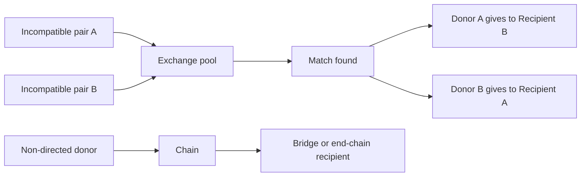
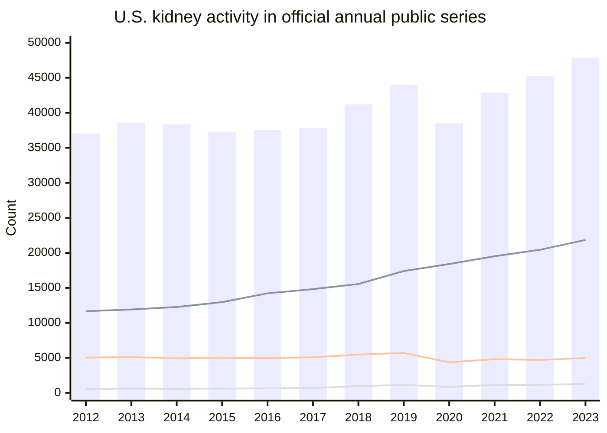
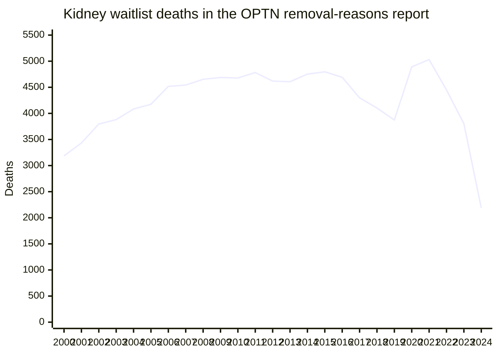

# Kidney Transplants and Kidney Exchange

## Executive summary

Kidney transplantation is the largest organ-transplant domain in the United States by volume, and kidney exchange has moved from a niche workaround for biologically incompatible living donor-recipient pairs to a material part of living donor transplantation. Publicly available official U.S. sources support several high-confidence conclusions. First, U.S. kidney transplant volume has continued to rise: HRSA reported **27,759 kidney transplants in 2024**, up **1.6%** from 2023, while total U.S. organ transplants reached **48,149**. Second, kidney exchange is no longer marginal: a U.S. peer-reviewed OPTN/UNOS analysis reported that **about 1 in 5 living donor kidney transplants in 2021** were facilitated by kidney paired donation, and the official 2023 SRTR kidney figure-data workbook shows **1,303 paired-donation transplants in 2023**. Third, waitlist mortality remains substantial even as transplant volume grows: the OPTN “Removal Reasons by Year” report shows **3,803 kidney-candidate deaths in 2023** and **2,187 deaths through August 31, 2024** in a provisional year-to-date file. citeturn59view0turn44view0turn26view0

The hardest part of your requested U.S. table is not transplant counts; it is the **exact kidney-only year-end waitlist series for 2000–2024** in a single downloadable, public, official annual file. The official SRTR kidney figure-data workbook that is publicly surfaced in accessible form covers **2012–2023** and provides annual new listings, annual “on the list during the year” prevalence, and transplant counts, but **not** a harmonized kidney-only **year-end** series for the full 2000–2024 range. Separately, OPTN public reports provide high-quality annual deaths/removals through 2024 year-to-date. I therefore present the strongest apples-to-apples official series that are publicly retrievable, and I flag where a measure is a **closest available official proxy** rather than the exact requested statistic. citeturn47search2turn43search8turn49search11turn26view0

On kidney exchange outside the United States, the evidence base shows a clear pattern. National or multinational kidney exchange programs are well established in **Canada**, **Australia/New Zealand**, **the United Kingdom**, **the Netherlands**, and several continental European countries documented through the ENCKEP network, with additional growth in **India** and longstanding early activity in **South Korea**. The most successful routine cross-border merger currently visible in the official English-language record is the **Australian and New Zealand Paired Kidney Exchange** program, established in 2019. By contrast, “global kidney exchange” in the stronger sense of linking rich- and lower-income countries into a single exchange pool has generated intense ethical and policy debate and only limited operational spread. citeturn62search1turn60search5turn60search2turn60search8turn60search6turn62search8

## Core concepts and methodological caveats

A conventional kidney transplant uses either a **deceased donor** kidney or a **living donor** kidney. The deceased-donor waitlist in the United States is managed through the OPTN. The National Kidney Foundation’s patient-facing explanation is directionally important here: the transplant waitlist is fundamentally the queue for **deceased-donor** kidneys; a living donor transplant can occur outside that queue if a compatible living donor is found. citeturn58search3turn58search15

Kidney exchange, also called kidney paired donation, allows an incompatible donor-recipient pair to swap with another pair so that both recipients receive compatible kidneys. HRSA’s patient-facing OPTN page notes that this can involve **two or more pairs**, and the 2024 review on practical and ethical issues in KPD notes that KPD now accounts for **nearly 20% of living donor kidney transplants in 2021–2022**. citeturn62search14turn61search6

The U.S. public data have three caveats that matter for interpretation. The SRTR annual kidney figure-data workbook counts **candidates and recipients under chapter-specific definitions**, often including **adult and pediatric**, **retransplant**, and sometimes **multiorgan** populations; for waitlist figures, chapter notes also state that candidates listed at more than one center may be counted **once per listing**, not once per person. The most accessible annual waiting-list prevalence figure in the workbook is **“on the list at any time during the year,”** not strict **year-end** counts. The OPTN “Removal Reasons by Year” report is excellent for deaths and transplant removals, but it is a **candidate-removal** file, so transplant-removal counts are not a perfect substitute for finalized transplant-procedure counts. Finally, the 2024 OPTN removal-reasons file available through search is explicitly **partial-year** through **August 31, 2024**, with data current as of **September 9, 2024**. citeturn49search11turn26view0

## United States longitudinal data

The table below is the strongest **single official annual U.S. series** I could compile from publicly accessible SRTR/OPTN materials for **2012–2023**. It uses the official SRTR kidney figure-data workbook for new listings, annual prevalence, deceased-donor transplants, living-donor transplants, and paired-donation counts; and the official OPTN removal-reasons report for annual waitlist deaths. The first column is **not year-end waitlist size**; it is the official SRTR annual prevalence measure, meaning candidates on the list at any time during the year. That is the closest public annual series that was retrievable in a consistent spreadsheet form. citeturn47search2turn43search8turn49search11turn26view0

### U.S. kidney annual activity from official public series

| Year | Candidates on list during year | New listings | Waitlist deaths | Deceased donor transplants | Living donor transplants excluding exchange | Kidney exchange transplants |
|---|---:|---:|---:|---:|---:|---:|
| 2012 | 133,642 | 37,051 | 4,619 | 11,669 | 5,055 | 564 |
| 2013 | 139,715 | 38,622 | 4,607 | 11,924 | 5,118 | 616 |
| 2014 | 144,371 | 38,346 | 4,753 | 12,279 | 4,954 | 584 |
| 2015 | 146,237 | 37,226 | 4,796 | 12,969 | 5,013 | 615 |
| 2016 | 145,461 | 37,551 | 4,691 | 14,229 | 4,968 | 661 |
| 2017 | 143,560 | 37,806 | 4,298 | 14,826 | 5,100 | 711 |
| 2018 | 144,221 | 41,201 | 4,103 | 15,560 | 5,469 | 973 |
| 2019 | 146,637 | 43,963 | 3,875 | 17,406 | 5,716 | 1,151 |
| 2020 | 141,400 | 38,484 | 4,891 | 18,408 | 4,373 | 861 |
| 2021 | 141,792 | 42,853 | 5,032 | 19,519 | 4,826 | 1,144 |
| 2022 | 142,921 | 45,283 | 4,448 | 20,446 | 4,716 | 1,148 |
| 2023 | 144,842 | 47,838 | 3,803 | 21,853 | 4,986 | 1,303 |

**Source notes and caveats.** The waitlist and transplant columns were compiled from the official SRTR kidney figure-data workbook linked from the Annual Data Report; those chapter figures are annual series built under chapter-specific definitions and are **not a strict kidney-only year-end waitlist file**. “Candidates on list during year” includes active and inactive candidates and is the closest public annual prevalence series I could retrieve consistently. New-listing figures count first listings in the given year and treat relisting after transplant as a new listing. Deceased-donor and living-donor transplant counts in the workbook include the chapter’s recipient definitions, which in the kidney chapter include adult/pediatric and may include retransplant and multiorgan recipients. Kidney-exchange counts were compiled from the workbook’s paired-donation living-donor categories; living-donor transplants excluding exchange are the arithmetic remainder after subtracting paired donation from total living-donor kidney transplants. Annual deaths come from the OPTN removal-reasons report and therefore reflect **candidate removals coded as death**, not a survival-model output. citeturn47search2turn43search8turn49search11turn26view0

A useful recent-year anchor is that an official OPTN-based 2023 kidney infographic reported **89,340** people on the **kidney organ waiting list** and **27,290** **kidney transplants** in 2023, while HRSA later reported **27,759 kidney transplants in 2024**. Those recent snapshot totals are directionally consistent with continued growth in transplant volume, but they are not laid out in a single public annual file that would let one reconstruct a clean 2000–2024 kidney-only year-end series. citeturn6view2turn59view0

### U.S. kidney waitlist deaths from the official OPTN removal-reasons report

| Year | Kidney-candidate deaths while on waitlist |
|---|---:|
| 2000 | 3,186 |
| 2001 | 3,433 |
| 2002 | 3,795 |
| 2003 | 3,881 |
| 2004 | 4,084 |
| 2005 | 4,175 |
| 2006 | 4,517 |
| 2007 | 4,543 |
| 2008 | 4,653 |
| 2009 | 4,688 |
| 2010 | 4,678 |
| 2011 | 4,783 |
| 2012 | 4,619 |
| 2013 | 4,607 |
| 2014 | 4,753 |
| 2015 | 4,796 |
| 2016 | 4,691 |
| 2017 | 4,298 |
| 2018 | 4,103 |
| 2019 | 3,875 |
| 2020 | 4,891 |
| 2021 | 5,032 |
| 2022 | 4,448 |
| 2023 | 3,803 |
| 2024* | 2,187 |

\* **2024 is provisional and partial-year** in the accessible OPTN report: removals from **January 1 through August 31, 2024**, with data current as of **September 9, 2024**. The report itself warns that future submissions and corrections may change the totals, and that totals can be less than the sums of rows because candidates may appear in multiple categories in some report formats. citeturn26view0

## U.S. kidney exchange ecosystem

The modern U.S. kidney-exchange landscape has three layers. At the policy layer, HRSA/OPTN operates the **Kidney Paired Donation Pilot Program**, which the OPTN says can involve two or more pairs and which an OPTN workgroup summary notes became operational in **2010**. At the market-clearing layer, the dominant publicly reported independent clearinghouse is the **National Kidney Registry**. At the program layer, national nonprofit and center-based networks—most prominently the **Alliance for Paired Kidney Donation** and a number of major transplant-center exchange programs—feed exchange activity. citeturn62search14turn56search1turn61search0turn61search1

The U.S. peer-reviewed trend paper is the cleanest macro summary: KPD has been increasing over time, with **1 in 5 living donor kidney transplants in 2021** facilitated by KPD, and around **40% of programs** reporting no KPD transplants in that year, implying a market with strong concentration in relatively few high-volume hubs. That concentration is consistent with the public NKR reports, which show substantial scale relative to the rest of the field. citeturn44view0turn45search2turn61search5

### Major U.S. clearinghouses and large exchange platforms

| Program | Scope | Rough public size | Notes |
|---|---|---:|---|
| National Kidney Registry | National independent clearinghouse | **1,744 facilitated transplants in 2024**; **27% of all U.S. living donor kidney transplants** by NKR’s accounting | Public reports include paired exchange, vouchers, remote directs, and some related categories, so NKR totals are broader than “paired exchange only.” citeturn61search5turn61search0 |
| OPTN Kidney Paired Donation Pilot Program | National public/OPTN platform | Public-facing HRSA materials do **not** surface a simple annual transplant count in the easily searchable page | Important national policy platform; operational since 2010. citeturn62search14turn56search1 |
| Alliance for Paired Kidney Donation | National nonprofit exchange network | Public website clearly identifies a national paired-donation network, but an easily comparable annual transplant count was **not surfaced** in the public pages I could retrieve | Also the leading public proponent of “global kidney chains.” citeturn61search1turn62search17turn60search6 |
| Large center-based exchange programs | Major academic/regional programs | Public reporting is fragmented and not standardized enough for fair apples-to-apples annual ranking | Johns Hopkins, Mayo, Northwestern, Cleveland Clinic, and others have historically contributed important exchange volume, but public annual counts are not uniformly reported in searchable official pages. citeturn61search6 |

A practical implication is that the **publicly visible U.S. exchange market is highly concentrated**. NKR is the only clearinghouse I could quickly verify with a recent, numerically explicit public annual report. For the OPTN pilot and for APD, the public-facing pages establish program existence and scope, but not a clean, current annual transplant count in a directly comparable format. citeturn61search5turn62search14turn61search1

## Kidney exchange outside the United States

The best broad English-language overview for Europe remains the ENCKEP literature, which documented established kidney exchange programs across multiple European countries and a serious policy effort to develop a **common framework** and a prototype for **transnational** exchange. ENCKEP’s own project materials explicitly describe the goal of sharing best practice and testing cross-border infrastructure rather than simply cataloguing isolated national programs. citeturn60search5turn60search2turn60search8turn60search14

**Canada.** Canada’s national Kidney Paired Donation program is operated by **Canadian Blood Services** as an **interprovincial** program. The official program pages describe it as a national allocation mechanism for living donor-recipient pairs who are not medically compatible, and Canadian Blood Services announced that the program reached **1,000 transplants** by 2022. That cumulative milestone implies a rough long-run average of around **75–80 transplants per year** since launch, with likely higher recent throughput than in the launch years. The program is national rather than multinational; in the public sources I reviewed, I did not find evidence that Canada has merged its exchange pool permanently with another country’s. citeturn62search0turn62search6turn62search9turn62search18

**Australia and New Zealand.** The **Australian and New Zealand Paired Kidney Exchange** program is the clearest routine cross-border merger now operating in English-language official sources. DonateLife states that the trans-Tasman ANZKX program was established in **2019** by combining the pre-existing national programs in both countries. The Australian Organ and Tissue Authority’s annual-report materials note that the first post-COVID trans-Tasman exchange resumed in **September 2022**, and a major Melbourne transplant center reported a **record year** in which **80 people received or gave a kidney** through the international program—roughly **40 transplants** in that year. citeturn62search1turn62search7turn62search13turn62search16

**United Kingdom.** The UK runs the **UK Living Kidney Sharing Scheme** nationally through NHS Blood and Transplant. Public NHS materials establish the scheme’s existence and national scope, while NHSBT’s recent annual living-donor reports show that **48% of registered recipients** in the scheme had been transplanted and that roughly **70–72% of identified transplants proceed**. The search snippet I retrieved did not surface a clean headline annual transplant-total for paired exchange alone, so the fairest summary is that the UK program is a mature national scheme with **substantial ongoing annual activity**, but I cannot responsibly quote a single annual paired-exchange count from the sources surfaced here without over-interpreting them. I also did not find evidence of a standing merger with a foreign exchange pool. citeturn63search12turn63search0turn63search6turn63search9

**Netherlands.** The Netherlands is one of the foundational European national KEPs. A classic outcomes paper reported that all Dutch transplant centers agreed on a protocol for a national living-donor kidney exchange program in **January 2004**, and the European overview literature continues to treat the Dutch scheme as one of Europe’s benchmark national models. The retrieved snippets did not expose a current annual transplant count in a registry-style dashboard, but the program is clearly longstanding and nationally integrated. European collaboration discussions have often treated the Dutch system as a model input into possible cross-border exchanges rather than a merged multinational pool in its own right. citeturn63search1turn63search10turn60search5

**Spain.** Spain’s living donor transplant system includes a **Spanish national kidney paired exchange scheme**, as described in a recent peer-reviewed global perspective on Spanish transplantation. The same source frames the paired scheme as part of Spain’s strategy to remove technical barriers to living donation. I did not retrieve a clean official public annual KEP-only count from Spanish national reporting in the search window, so the most defensible summary is that Spain has an established national KEP embedded in a very high-performing transplant system, but transparent annual KEP-specific volume is not as easy to surface publicly in English as for Canada or ANZKX. citeturn63search2turn63search11

**India.** India’s kidney-exchange growth has been rapid and clinically important, especially because deceased donation remains relatively limited compared with demand. The most detailed English-language numeric snippet I retrieved is a 2025 news summary of a multicenter study reporting **1,839 kidney swaps between 2000 and 2024** nationwide, with **Gujarat accounting for 569** and one major Ahmedabad center having performed **more than 600** exchange procedures cumulatively. A later report from the same ecosystem said **86 of 302** living donor kidney transplants in one year at that center were swaps. These are not official national-registry outputs, so they should be read as strong but secondary evidence. They also show that India is one of the clearest examples of exchange becoming a sizable national strategy rather than a purely local workaround. citeturn60news30turn61news33turn61news34

**South Korea.** The broader review literature continues to identify **South Korea** as the site of the first performed kidney paired donation in **1991**, making it historically pivotal even if recent public annual-volume reporting is harder to surface in English. In the materials I retrieved, South Korea appears more strongly as a historical origin point than as a country with easily searchable current public KEP-volume dashboards. citeturn62search8

**Additional documented European countries.** The ENCKEP overview documented exchange-program development across a wider European field than the short country notes above can cover in a citation-clean way here, including countries such as **Austria, the Czech Republic, Poland, Portugal, Switzerland, and others** in various states of operation or development. The common theme was not only national implementation but also serious work on legal and technical harmonization for future cross-border matching. citeturn60search5turn60search14

## Global kidney exchange and cross-border efforts

The term **global kidney exchange** is usually used more narrowly than plain cross-border exchange. It refers to linking incompatible pairs across countries, often with explicit financing arrangements that allow a lower-income-country pair to enter a higher-income-country exchange pool. The best-known public advocate has been the **Alliance for Paired Kidney Donation**, whose “Global Kidney Chains” materials describe a model in which foreign patient-donor pairs can participate in American exchange chains, with financing justified partly by dialysis savings in the U.S. system. The same page also acknowledges the two central controversies: the optics that more U.S. than foreign patients may be transplanted in a given chain, and the ethical concern that large economic asymmetries can make the arrangement appear exploitative even when medically beneficial. citeturn60search6

In practice, the most durable and clearly documented cross-border exchange program in the material I reviewed is **ANZKX**, the Australia–New Zealand merged pool. That is cross-border, but it is not usually what people mean by “global kidney exchange” in the bioethics debate; it is better understood as a transnational regional merger of two high-income-country programs. Europe, through **ENCKEP**, appears to have moved furthest on the technical and policy design of transnational exchange infrastructure, but the materials I retrieved describe prototype-building and coordination rather than a single standing Europe-wide routine exchange pool comparable to ANZKX. citeturn62search1turn62search7turn60search14turn60search2

### Programs that attempted or explicitly developed global or cross-border exchange

| Program or effort | Description | Observable outcome in the retrieved record |
|---|---|---|
| Alliance for Paired Kidney Donation Global Kidney Chains | Explicit U.S.-anchored proposal to include foreign incompatible pairs in American exchange chains, with financing linked to dialysis savings and philanthropy | Ethically influential and persistently debated; the public APD materials emphasize concept and rationale more than a large routine global operating volume. citeturn60search6turn61search1 |
| Australian and New Zealand Paired Kidney Exchange | True merged trans-Tasman exchange pool; combines the national programs of two countries | Operational since 2019; resumed trans-Tasman exchange in 2022 after COVID disruption; clearly the strongest routine cross-border example found. citeturn62search1turn62search7 |
| ENCKEP transnational prototype work | European project to harmonize data, optimization, and legal/clinical practice for possible transnational KEPs | Strong design and coordination effort; evidence of prototype development and policy dialogue, but not a single permanent Europe-wide pool in the sources surfaced here. citeturn60search14turn60search2turn60search8 |

## What is missing and how to interpret the gaps

The biggest gap is the exact **kidney-only year-end U.S. waitlist series for 2000–2024** in a single public official file that is straightforwardly retrievable through the open web. The public annual SRTR kidney workbook provides a strong **2012–2023** annual activity series, but it gives **“on the list during the year”** rather than a harmonized kidney-only year-end count. Recent snapshot materials do show that the kidney waitlist remains very large—**89,340** in the 2023 OPTN-based kidney infographic—and HRSA’s 2025 press release confirms continuing transplant growth in 2024, but those materials do not close the full historical year-end gap by themselves. citeturn47search2turn49search11turn6view2turn59view0

The second gap is that not all official public sources use the same unit. Some count **candidates**, some count **listings**, some count **transplant recipients**, and some count **living donors**. Multi-listing, relisting after prior transplant, and inclusion of kidney-pancreas or other multiorgan recipients can all move the totals. That is why the report above avoids silently stitching incompatible series into one false-precision table. Where I had a clean official series, I used it; where I could not, I said so explicitly. citeturn49search11turn26view0

The third gap is international transparency. Canada and ANZKX have comparatively accessible public descriptions and milestone counts. For the UK, the Netherlands, Spain, and several European programs, program existence and maturity are clear, but public English-language sources do not always surface a neat annual paired-exchange count in the first page of retrieval. Europe’s transnational work is especially strong on **institutional design**, and weaker—at least in publicly surfaced, English-language web snippets—on easy, centralized, frequently updated public dashboards. citeturn62search18turn62search13turn63search0turn63search1turn63search2turn60search14