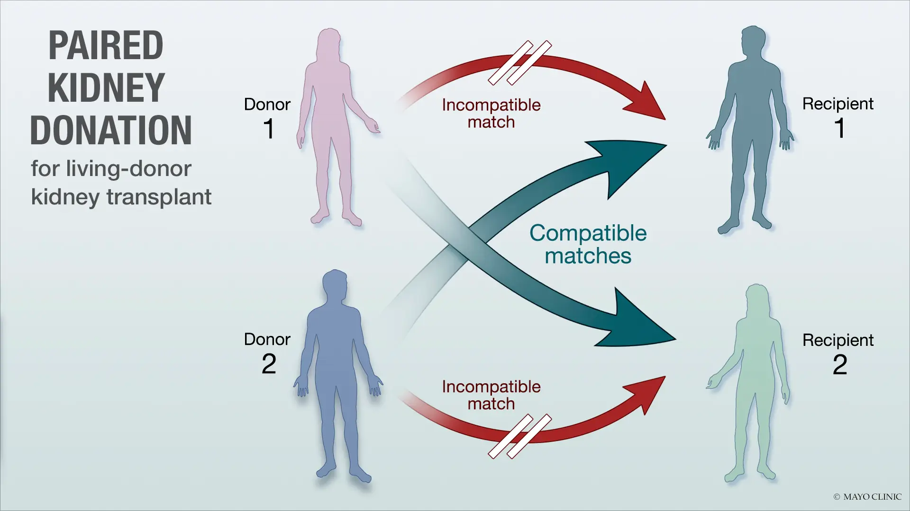
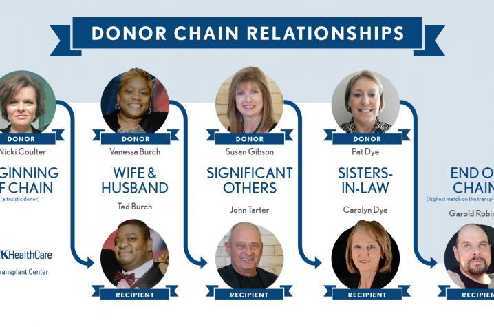
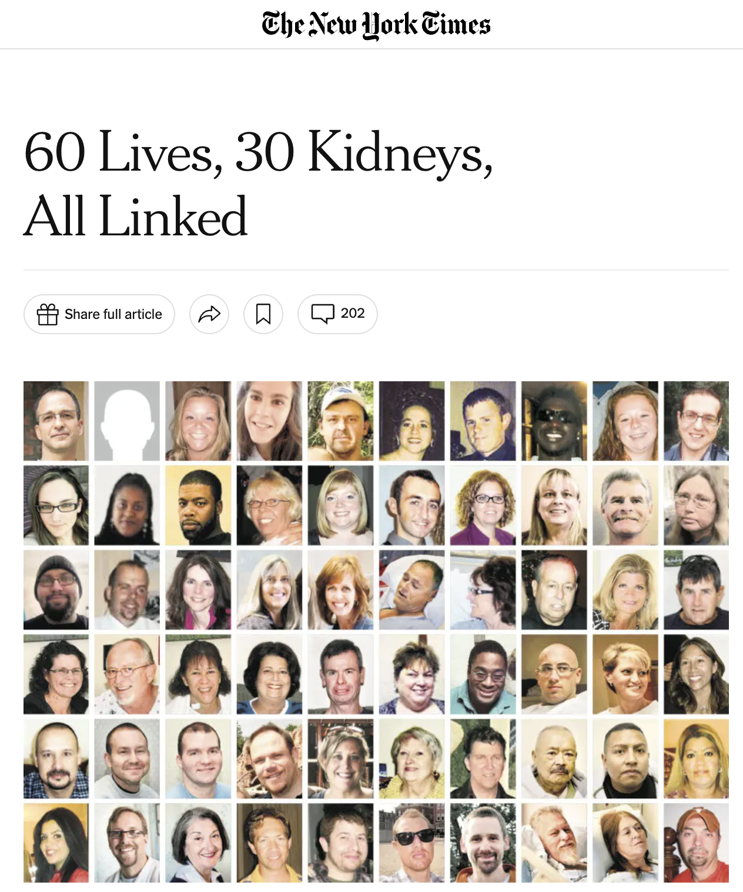
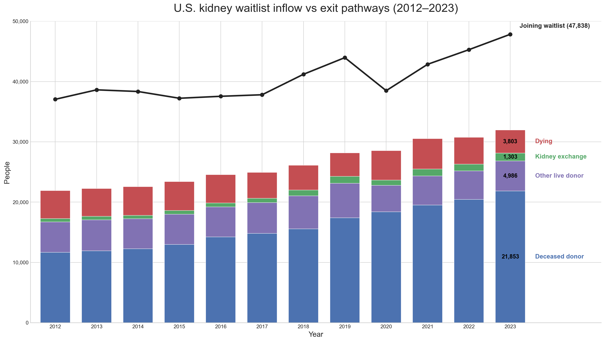
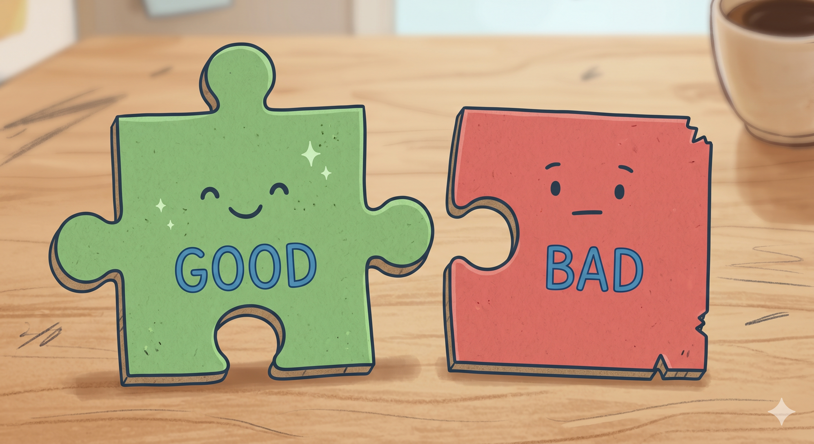
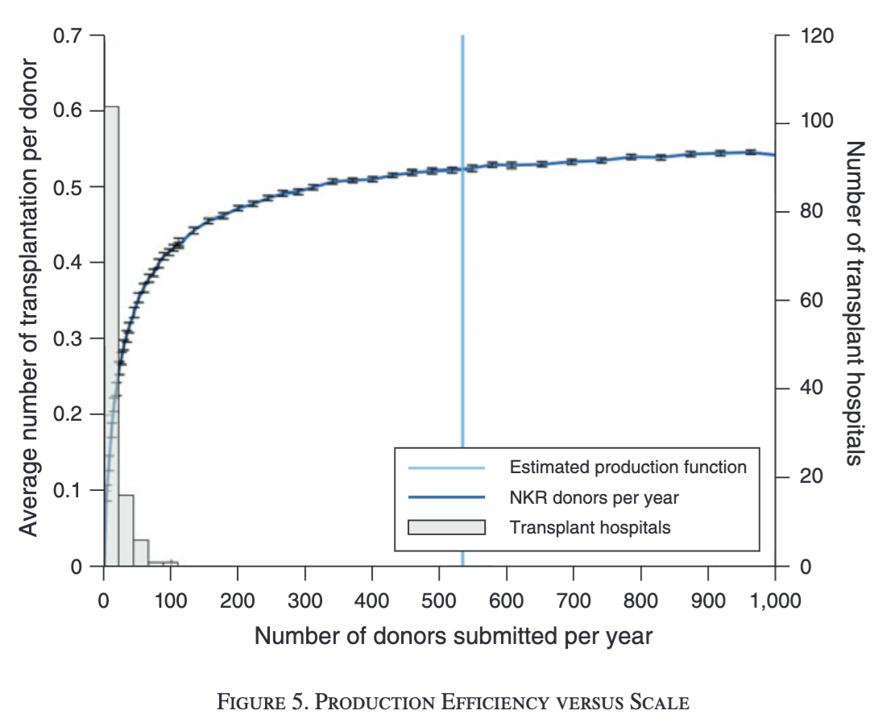
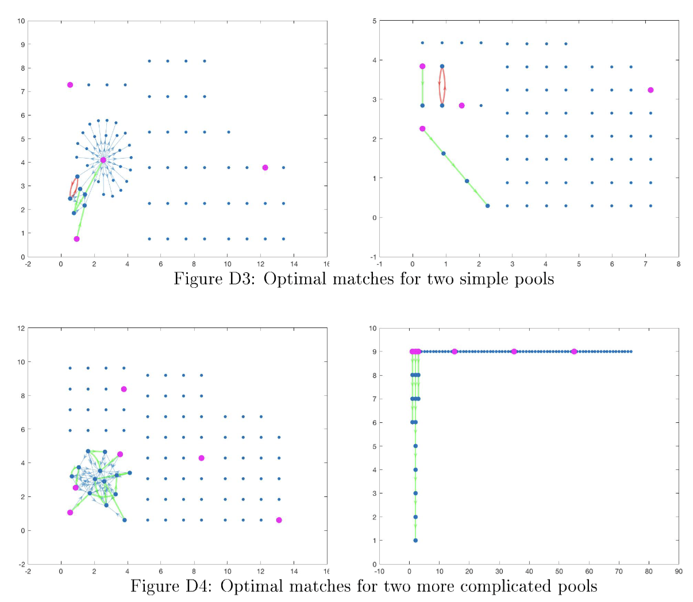
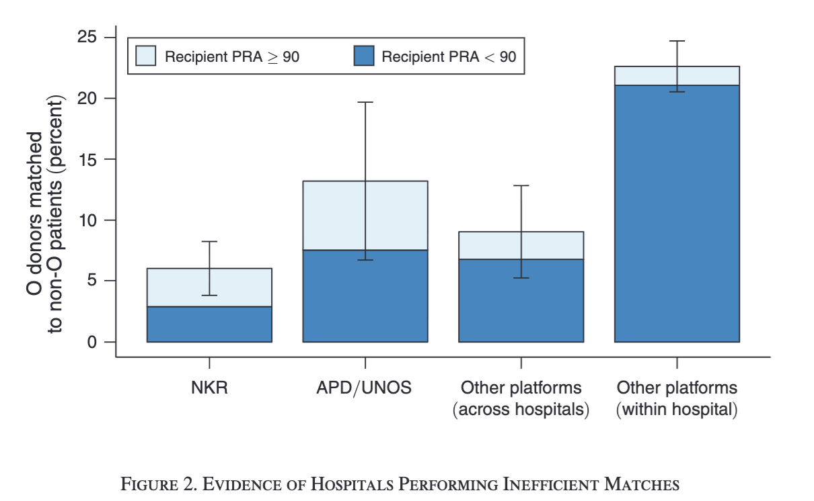

## An amazing invention

{.hero-image}

## An amazing invention

{.hero-image}

## An amazing invention

{.hero-image}

## Thousands of lives per year

{.hero-image .wide-image}

## Thousands of Lives. Billions of Dollars.

:::: {.columns}
::: {.column width="52%"}

The Staggering Scale of End-Stage Renal Disease (ESRD) in the U.S.

- **89,340** — People on the U.S. kidney transplant waiting list (2023)
- **~$55 Billion** — Annual U.S. Medicare spending on ESRD
- **~7%** — Portion of all Medicare Fee-For-Service (FFS) spending dedicated to ESRD
- **~0.9%** — Portion of the entire U.S. Federal Budget

:::
::: {.column width="48%"}

[{width=100%}](https://www.youtube.com/watch?v=yw_nqzVfxFQ)

:::
::::

## Theory of almost everything

{.hero-image}

## Theory of almost everything

:::: {.columns}
::: {.column width="55%"}

{.hero-image}

:::
::: {.column width="45%"}

  f(ngood, nbad) ≈ 2 ngood

:::
::::

## Theory of everything

:::: {.columns}
::: {.column width="55%"}

{.hero-image}

:::
::: {.column width="45%"}

  
f(ngood, nbad) ≈ 2 ngood · scale(ntotal)

  
scale(200 pairs / year) ≈ 1

:::
::::

## Algorithms are trivial: just don’t waste good pairs

{.hero-image}

## Fragmentation is costly

:::: {.columns}
::: {.column width="45%"}

- Large U.S. hospitals often do not join NKR and often perform inefficient matches.
- NKR has improved this with a point system over the last 10 years.
- The logic is similar to the theoretical market-efficiency solution.
- Country exchanges below the efficiency threshold should aim to merge (eg Australian and NZ).

:::
::: {.column width="55%"}

{.hero-image}

:::
::::

## Global kidney exchange

:::: {.columns}
::: {.column width="52%"}

- Links incompatible donor-recipient pairs across countries.
- The key idea is trading money or financing for access to more “good pairs.”
- The promise is more transplants; the controversy is ethics, distribution, and exploitation risk.
- 17 foreign donors so far.

:::
::: {.column width="48%"}

[{width=100%}](https://www.youtube.com/watch?v=llh-2pqSGrs)

:::
::::

## Past and future

- **1991**: First living donor kidney exchange is performed in South Korea by Dr. Kiil Park.
- **2004**: New England Program for Kidney Exchange (NEPKE) is established, becoming the first multi-center program to use a computer-optimized matching algorithm.
- **2006**: Alliance for Paired Kidney Donation (APD) is established by Dr. Michael Rees.
- **2007**: National Kidney Registry (NKR) is established by Gareth Hill.
- **2009**: Chains go mainstream following the publication of a landmark *New England Journal of Medicine* paper on non-simultaneous extended altruistic donor (NEAD) chains and the completion of the first 16-patient multicenter domino chain.
- **2014**: NKR adopts a point system and Advanced Donation Program (the “voucher” program), allowing donors to give a kidney in advance of their intended recipient needing one.
- **2015**: First Global Kidney Exchange is completed, pioneered by the APD to facilitate transplants across international borders.

## Thank you!

[{width=720px}](https://www.youtube.com/watch?v=exB1O3pTf7E)

[Better talk: Alvin Roth on kidney exchange](https://www.youtube.com/watch?v=exB1O3pTf7E)

People to look up

Itai Ashlagi · Al Roth · Tayfun Sönmez · Utku Ünver · Gareth Hill · Michael Rees
